- Подготовительный этап
    создали директорию, docker-compose.yml, поместили дата-сеты в директорию, 
    создали индекс
    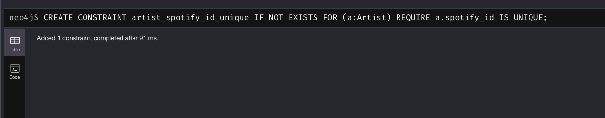
    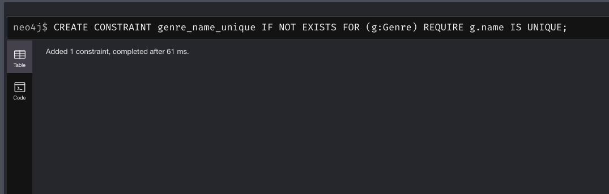
    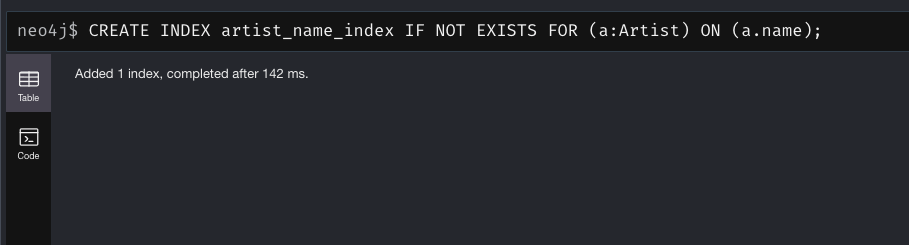

    импорты и установление связей
    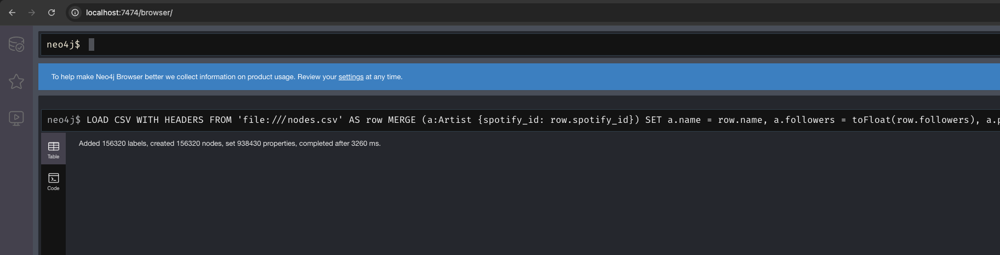
    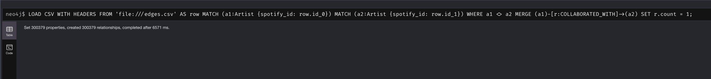

- Аналитические запросы
    топ-10 артистов по количеству коллабораций
    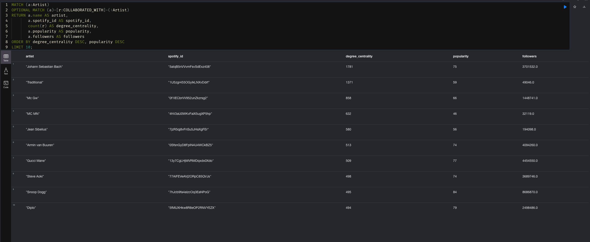
    Самый жанрово-разнообразный артист по жанрам его коллабораторов
    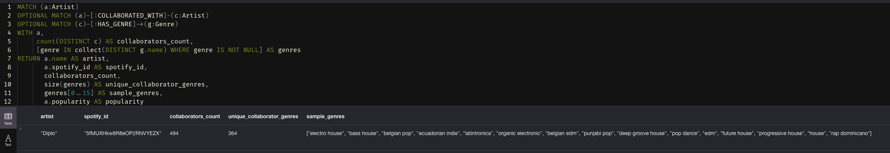

    время с индексом - 110 мс
    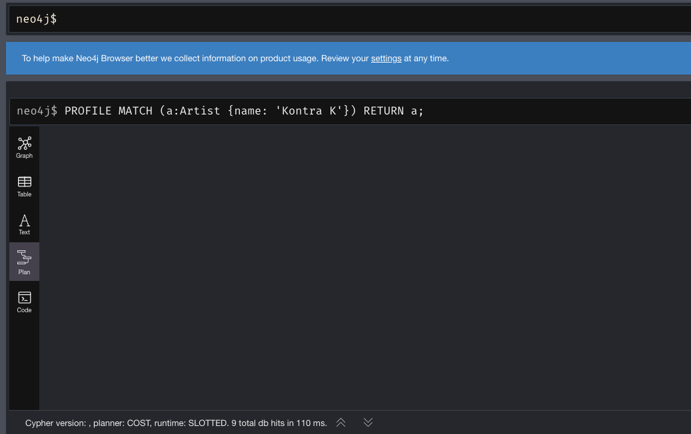

    время без индекса - 124 мс
    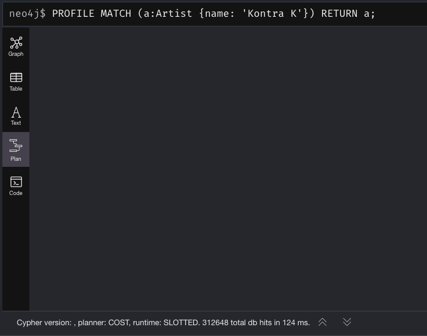

- Обогащение модели
    Обогатили модель сущностью `Country`, отражающая страны, в чартах которых присутствовал артист. Это позволит анализировать географическое распространение популярности исполнителей. Между узлами `Artist` и `Country` было введено отношение `CHARTED_IN`. 
    code:
    CREATE CONSTRAINT country_code_unique IF NOT EXISTS
    FOR (c:Country)
    REQUIRE c.code IS UNIQUE;

    MATCH (a:Artist)
    WITH a,
        CASE
        WHEN a.chart_hits_raw IS NULL OR trim(a.chart_hits_raw) = '[]' THEN []
        ELSE [entry IN split(replace(replace(replace(trim(a.chart_hits_raw), "[", ""), "]", ""), "'", ""), ",")
                | trim(entry)]
        END AS chart_entries
    UNWIND chart_entries AS entry
    WITH a, entry, split(entry, " (") AS parts
    WHERE size(parts) = 2
    WITH a,
        trim(parts[0]) AS country_code,
        toInteger(replace(parts[1], ")", "")) AS hits
    WHERE country_code <> "" AND hits IS NOT NULL
    MERGE (c:Country {code: country_code})
    MERGE (a)-[r:CHARTED_IN]->(c)
    SET r.hits = hits;

    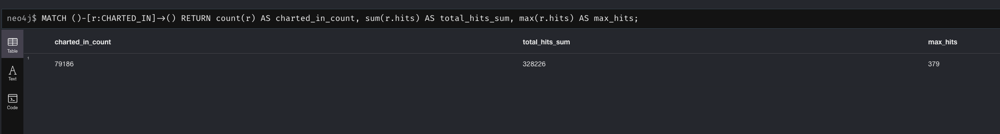
    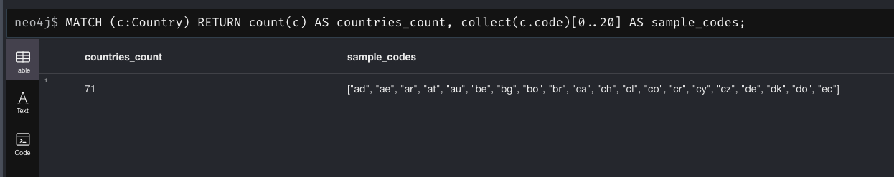

- Задание 3. Жанровая экосистема
    Постройте граф жанров (projection), где два жанра связаны, если между их представителями существует хотя бы одна коллаборация. Определите:
        Какие жанры наиболее "центральны" в современной музыке?
        Какие пары жанров имеют самую сильную связь?
        Есть ли изолированные жанры?

    постройка жанрового графа
    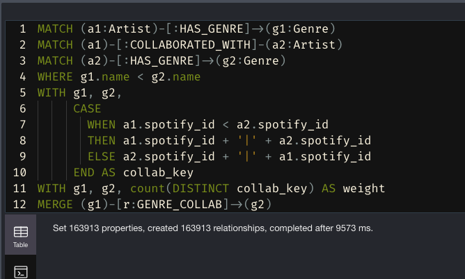

    самые "пересекаемые" или "центральные" жанры
    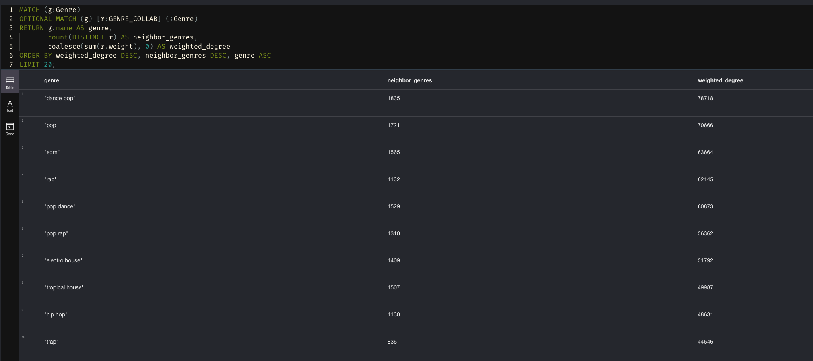

    пары жанров с самой сильной связью
    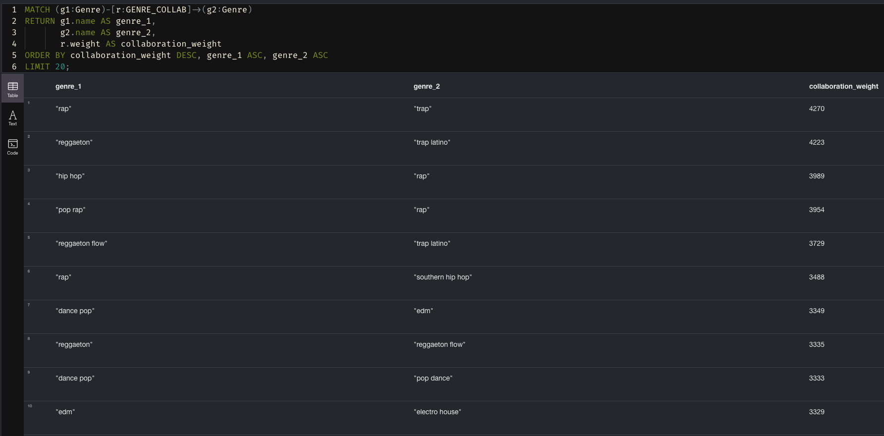

    жанры одиночки
    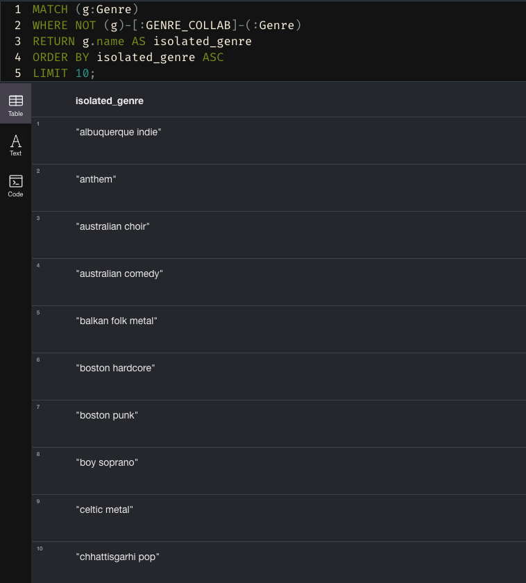

- Задание 4. Цепочка артистов
    связь находится часто через других популярных разностороннихартистов
    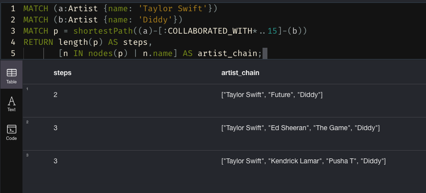

    

